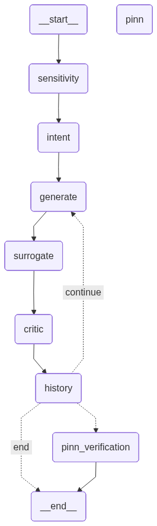

# Epi_PINN_LLM_Param

**Interpretable Expert-Informed Epidemic Forecasting via Hybrid Mechanistic and LLM-Based Modeling**

[](https://www.python.org/downloads/)

Short description:  
A human-in-the-loop framework that integrates expert knowledge into epidemic forecasting by adjusting epidemiological parameters (β, γ, μ) using a multi-agent LLM system. Unlike black-box or loss-modifying approaches, this method provides interpretable, verifiable forecast adjustments.

## Table of Contents
- [Background](#background)
- [Installation](#installation)
- [Usage](#usage)
- [Pipeline Overview](#pipeline-overview)
- [Project Structure](#project-structure)
- [Results](#results)
- [Citation](#citation)
- [License](#license)

## Background

Epidemic forecasts often rely on either:
- **Classical SIRD models** – interpretable but inaccurate, or
- **Black-box models** – accurate but uninterpretable.

This work combines **Physics-Informed Neural Networks (PINNs)** with **LLM agents** to:
1. Calibrate initial parameters from data.
2. Adjust parameters based on natural-language expert feedback.
3. Generate final forecasts with uncertainty (Monte Carlo Dropout).

The LLM agents translate requests like *"the peak should be higher"* into meaningful changes in β, γ, μ – consistent with SIRD logic.

## Installation

```bash
git clone https://github.com/vnlenenko/Epi_PINN_LLM_param.git
cd Epi_PINN_LLM_param
pip install -r requirements.txt
```

Create a `.env` file for your LLM provider settings (if needed).

## Usage

### Quick test
```bash
python main_test.py
```

### Run full pipeline
```bash
# Phase 1: calibrate on real/synthetic data
python phase1_calibrate.py --data data/covid_spb.csv

# Phase 2: adjust parameters via LLM agents (example request)
python phase2_adjust.py --request "the peak should be higher"

# Phase 3: forecast with fixed parameters
python phase3_forecast.py
```

### Example
```python
from agents.parameter_generator import adjust_parameters
from models.pinn_model import train_pinn_fixed

# Initial parameters from Phase 1
params = {'beta': 0.1219, 'gamma': 0.0990, 'mu': 0.0099}

# Expert feedback
new_params = adjust_parameters(params, "the peak should be lower")
# -> {'beta': 0.1185, 'gamma': 0.0997, 'mu': 0.0098}

# Final forecast
forecast = train_pinn_fixed(new_params)
```

## Pipeline Overview



**Phase 1** – Model calibration (SIRD or PINN) → initial β, γ, μ.  
**Phase 2** – LLM agents parse expert comment → sensitivity analysis → adjusted parameters → synthetic SIRD data.  
**Phase 3** – PINN retrained with fixed adjusted parameters → final forecast + confidence intervals (Monte Carlo Dropout).

## Project Structure

```
EPI_PINN_LLM_PARAM/
├── agents/              # LLM agents (Intent Parser, Parameter Generator, Critic)
├── formats/             # Prompt templates and output schemas
├── tools/               # Sensitivity analysis, SIRD simulation
├── utils/               # Data loading, metrics, plotting
├── config.py            # Configuration (model hyperparams, LLM settings)
├── main_test.py         # Entry point for testing
├── pipeline_graph.png   # Visual pipeline summary
├── README.md            # This file
├── .env                 # API keys (not committed)
└── requirements.txt     # Dependencies
```

## Results

- **Parameter adjustment** – LLM agents correctly change β, γ, μ according to expert intent (e.g., higher peak → β↑, R₀ from 1.119 → 1.194).  
- **Forecast shift** – Final PINN forecast shows the requested change (higher/lower peak) with uncertainty bands.  
- **Model-agnostic** – Works with both SIRD and PINN in Phase 1.

Example (real COVID-19 data, St. Petersburg):

| Request               | β      | γ      | μ      | R₀   |
|-----------------------|--------|--------|--------|------|
| Baseline (Phase 1)    | 0.1219 | 0.0990 | 0.0099 | 1.119|
| "The peak higher"     | 0.1295 | 0.0986 | 0.0099 | 1.194|
| "The peak lower"      | 0.1185 | 0.0997 | 0.0098 | 1.082|

## Citation

If you use this code or framework, please cite:

```bibtex
@inproceedings{gindullina2026interpretable,
  title={Interpretable Expert-Informed Epidemic Forecasting via Hybrid Mechanistic and LLM-Based Modeling},
  author={Gindullina, Dinara and Leonenko, Vasiliy},
  booktitle={Proceedings of ...},
  year={2026}
}
```